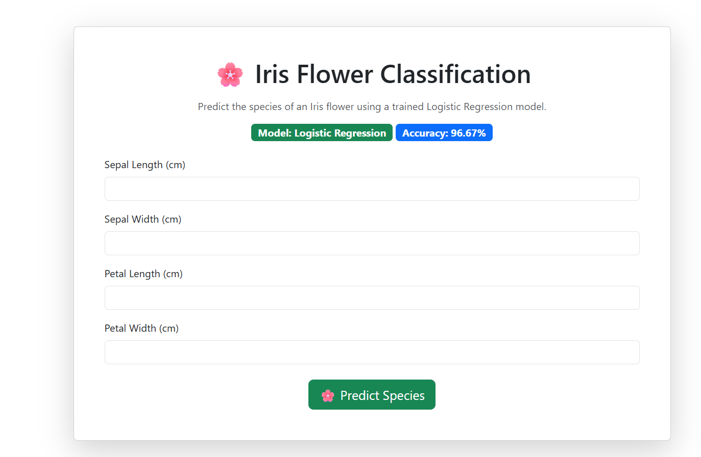
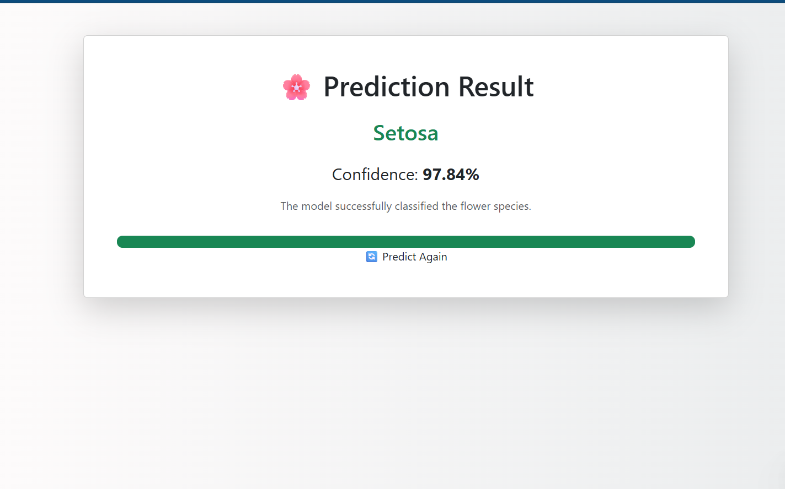

# 🌸 Iris Flower Classification using Flask

A Machine Learning web application that predicts the species of an Iris flower using a trained Logistic Regression model. The application is built with Flask and provides an interactive web interface for users.

---

##  Features

- Predict Iris flower species
- Logistic Regression model
- 96.67% accuracy
- Clean Bootstrap UI
- Flask backend
- Confidence score display

---

##  Tech Stack

- Python
- Flask
- Scikit-learn
- Pandas
- NumPy
- Bootstrap 5
- HTML
- CSS
- Joblib

---
## 📸 Screenshots

### Home Page



### Prediction




## Project Structure

iris-flask-app/
│── app.py
│── train_model.py
│── requirements.txt
│── model/
│   ├── model.pkl
│   └── class_names.pkl
│── templates/
│   ├── index.html
│   └── result.html
│── static/
│── README.md

---

##  Installation

```bash
git clone <repository-url>
cd iris-flask-app
pip install -r requirements.txt
python app.py

